# BROOKLYN NINE NINE

Let's start with the port enumeration phase, saving the results in a file named scan.
`nmap -p- --open -sS -min-rate 5000 -vvv -n -Pn 10.10.195.47 -oG scan`

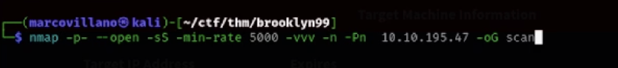

Here's what we found

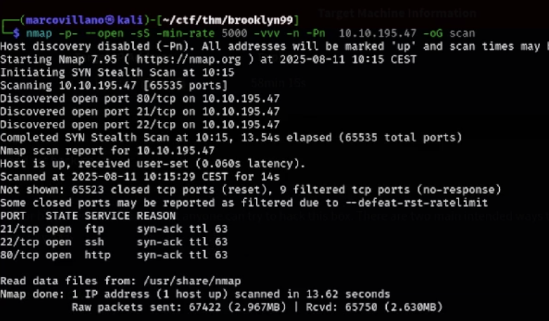

Let's do a detailed scan of the ports and save the result in a file named ports

`nmap -p21,22,80 -sCV 10.10.195.47 -oN ports`

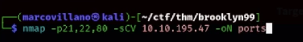

Here's what he found

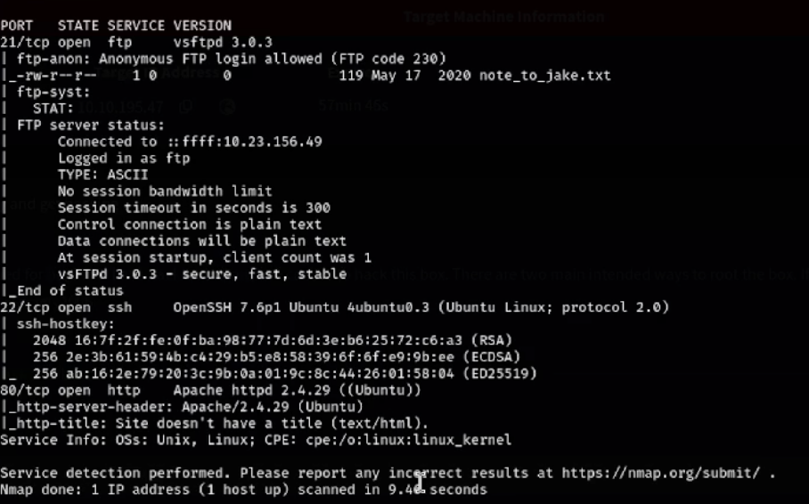

We see that port 21 allows anonymous login without a password, and we also found a file called *note_to_jake.txt* in the port.
Port 22 requires credentials to log in, so we'll skip it for now.
Port 80 runs http service, so a web finger.

Let's start with port 80.
Then open the browser and paste the machine's IP address.

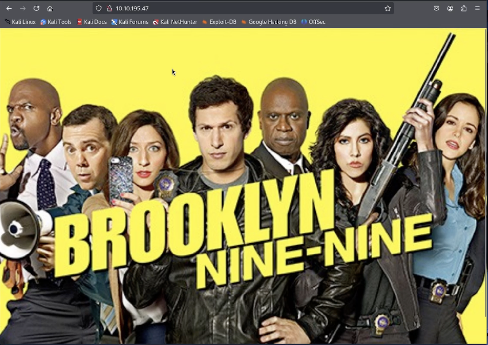

There doesn't seem to be anything on the site.
Let's see if it has any subdomains with gobuster.

`gobuster dir -u http://10.10.195.47 -w /usr/share/wordlists/dirbuster/directory-list-1.0.txt`

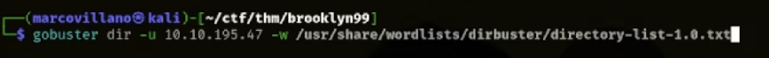

You won't find anything here. Don't waste your time.

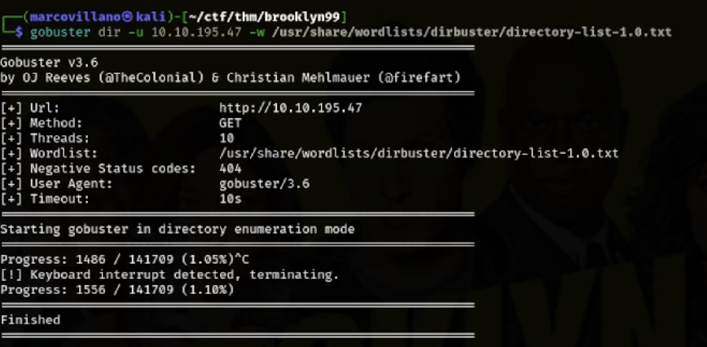

Let's go back to the website and analyze the source code ctrl+u

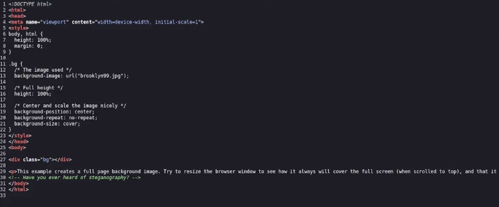

We found a comment that refers to steganography.

So let's inspect the web page to find the name of the image.

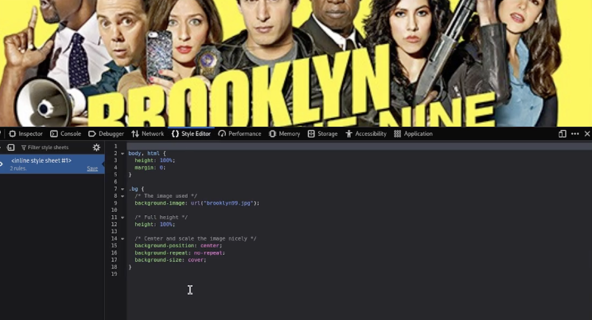

Found it!
Let's use wget to grab the image.

`wget 10.10.195.47/brooklyn99`

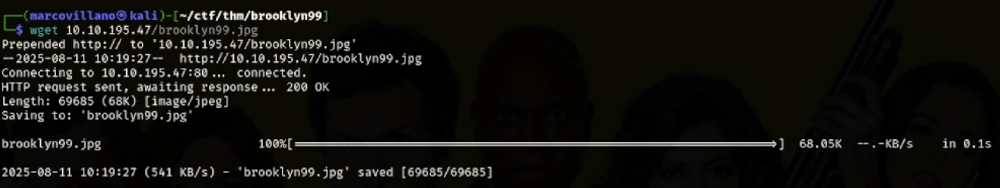

We use steghide to find information within the image.

`steghide extract -sf brooklyn99`

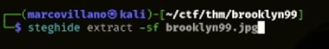

No luck, it asks us for the password. 

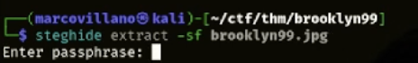

We use stegcracker, which is very useful in these situations.

`stegcracker brooklyn99 /home/marcovillano/Downloads/rockyou.txt`

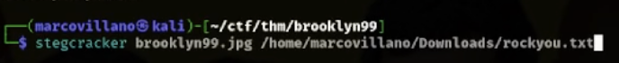

Password found!

Let's go back to steghide and enter the password. 

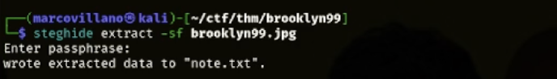

It extracted the file “note.txt.” Let's see what's inside.

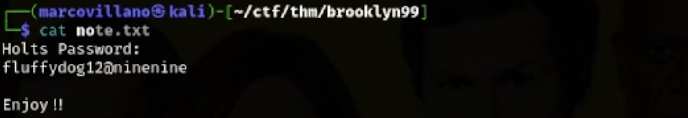

A user name and password. They may be useful for port 22.
But first, let's enter port 21.

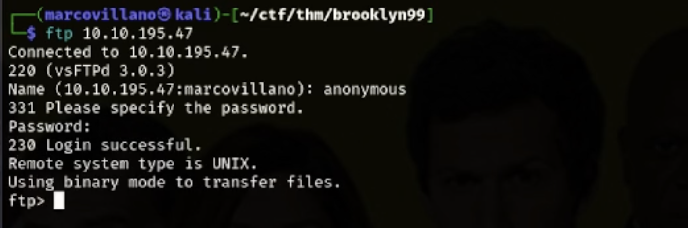

We're in.
Let's do ls to see if there are any files.

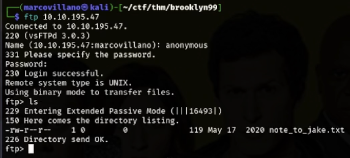

There is a file called “note_to_jake.txt”. Let's get it with get.
Let's see what's inside the file.

It tells us that Jake's password is weak, so we can try using hydra.

`hydra -l jake -P /home/marcovillano/Downloads/rockyou.txt`

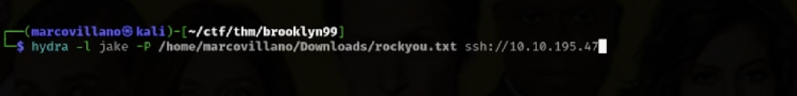

Found!! 

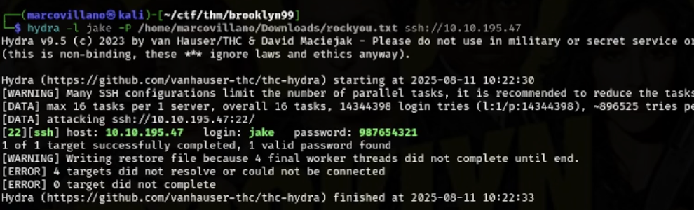

Now let's go in.
Let's try Jake first.

`ssh jake@10.10.195.47`

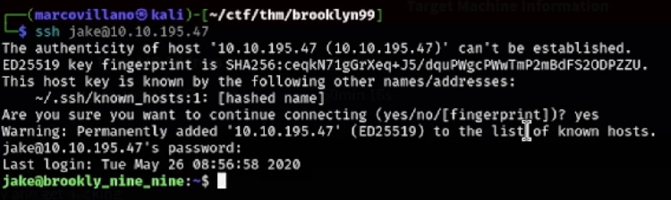

Perfect, we're in.

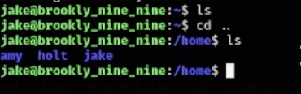

Let's go inside Holt.
First flag found!

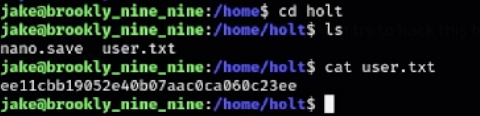

Now let's look for the root flag.
We need to escalate privileges.

`find / -perm -4000 2>/dev/null`

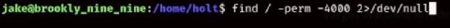

Okay, he found something.

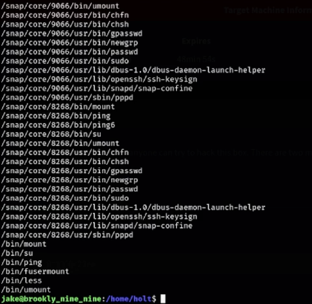

Now let's use a very useful website for GTFOBins privilege escalation.
On this website, we can check the binaries that have been released.
Let's do a `sudo -l`

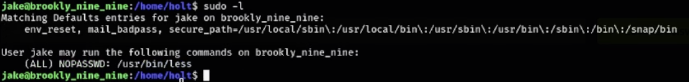

It tells us that there is something in the binary.
So let's look for it on GTFOBins.

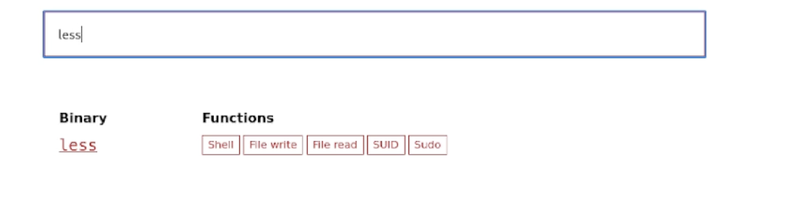

He tells us he has a sudo

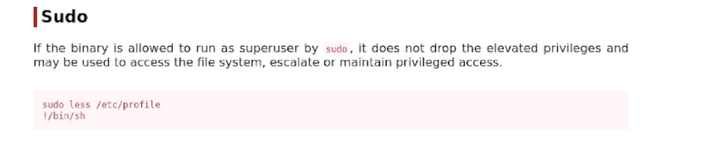

It tells us to do `sudo less /etc/profile` and give him `!/bin/sh`

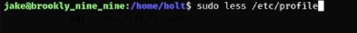

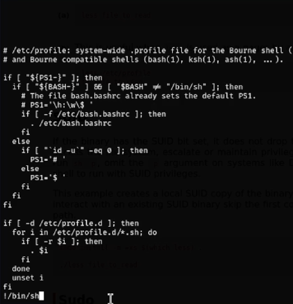

Let's do it and we'll be root.

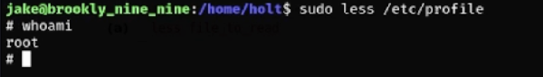

Let's make a cd /root to find the root flag.

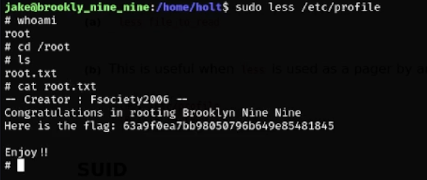
