# CRACK THE HASH
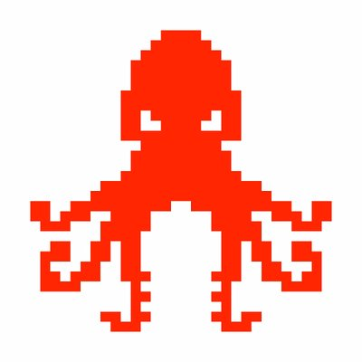

## LEVEL 1

### #1
**Hash**: `48bb6e862e54f2a795ffc4e541caed4d`

We use `hash-identifier` to see what kind of hash it is

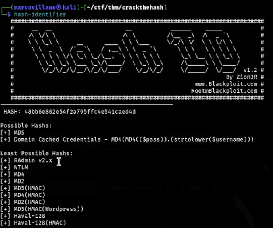

We can use `hashcat` or CrackStation.

#### HASHCAT

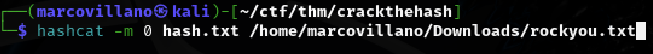

#### CRACKSTATION

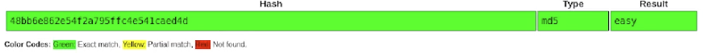

### #2
**Hash**: `CBFDAC6008F9CAB4083784CBD1874F76618D2A97`

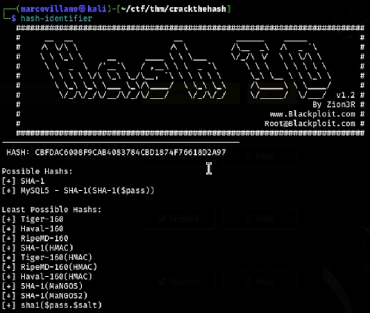

#### HASHCAT

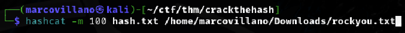

#### CRACKSTATION

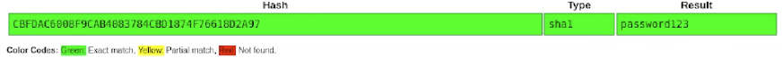

### #3
**Hash**: `1C8BFE8F801D79745C4631D09FFF36C82AA37FC4CCE4FC946683D7B336B63032`

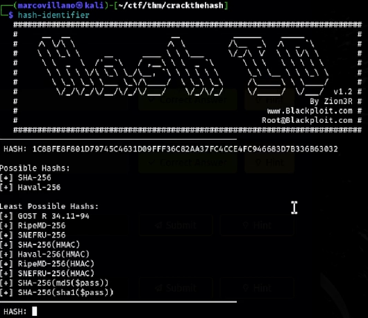

#### HASHCAT

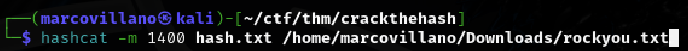

#### CRACKSTATION

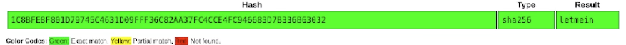

### #4
**Hash**: `$2y$12$Dwt1BZj6pcyc3Dy1FWZ5ieeUznr71EeNkJkUlypTsgbX1H68wsRom`

For this hash, we use [Tunnelsup](https://www.tunnelsup.com/hash-analyzer/) to decrypt it, we always use hashcat.
P.s. This will take a long time.

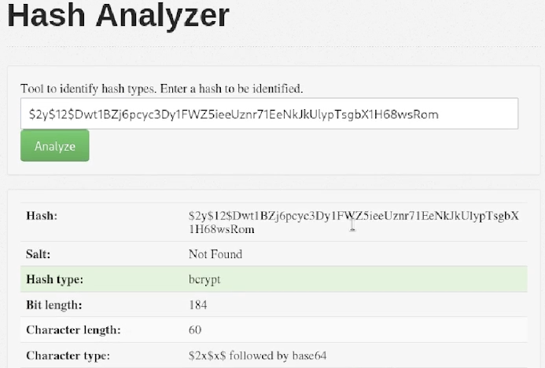

#### HASHCAT

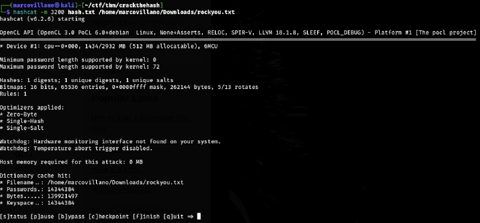

**Solution**: `bleh`
### #5
**Hash**: `279412f945939ba78ce0758d3fd83daa`

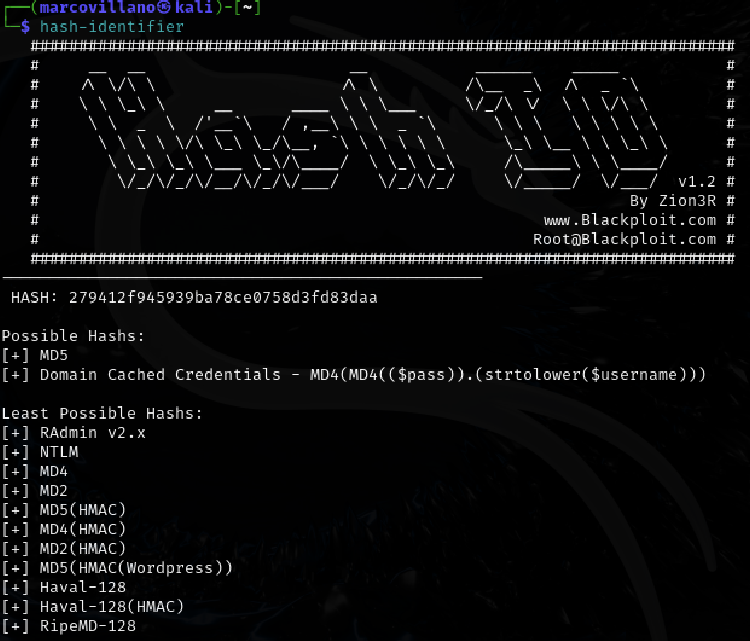

#### HASHCAT

#### CRACKSTATION

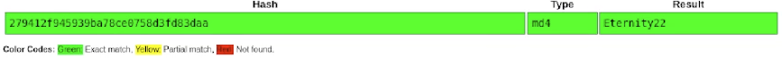

## LEVEL 2

### #1
**Hash**: `F09EDCB1FCEFC6DFB23DC3505A882655FF77375ED8AA2D1C13F640FCCC2D0C85`

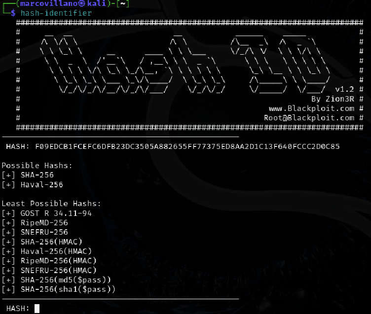

#### HASHCAT

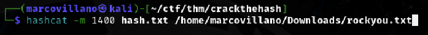

#### CRACKSTATION

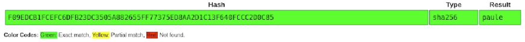

### #2
**Hash**: `1DFECA0C002AE40B8619ECF94819CC1B`

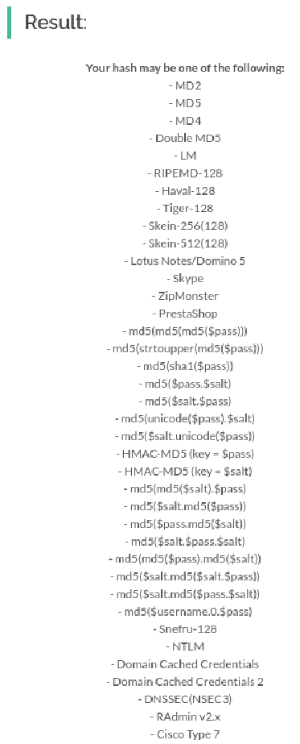

#### HASHCAT

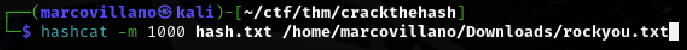

#### CRACKSTATION

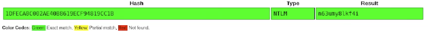

### #3
**Hash**: `$6$aReallyHardSalt$6WKUTqzq.UQQmrm0p/T7MPpMbGNnzXPMAXi4bJMl9be.cfi3/qxIf.hsGpS41BqMhSrHVXgMpdjS6xeKZAs02.`

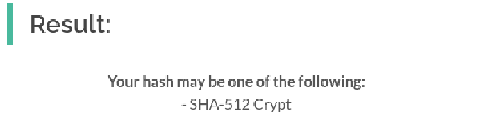

#### HASHCAT

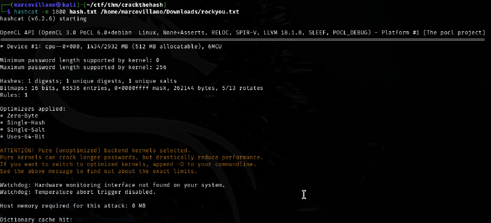

**Solution**: `waka99`
### #4
**Hash**: ` e5d8870e5bdd26602cab8dbe07a942c8669e56d6`

#### HASHCAT

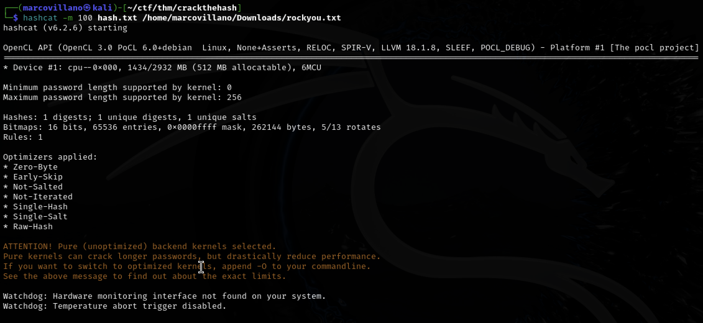

**Solution**: `481616481616`
