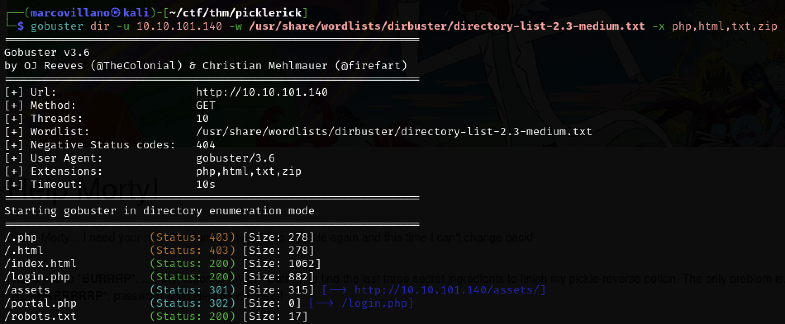

# PICKLE RICK 🥒

Let's start with the port enumeration

Browse to webpage at the `IP MACHINE`

Let's analyze the site code

We find a username, it will be useful later

We use gobuster to find some directories and pages on the site, infact we found many pages

Browse to `robots.txt` and we found a password

Browse to `login.php`, we have a login page. Let's try to use the credentials found before

Let's see what's inside the directory

Let's try to read the file `Sup3rS3cretPickl3Ingred.txt`

OK, there's not much we can do.
We use a reverse shell.

We use the pentestmonkey cheat sheet for PERL reverse shell.
So start a listener on port 1337

Let's copy the command and change the IP and the port

WELL DONE!

So... Let's take the first flag

Let's examine the file `clue.txt`

Browse to /home/rick folder and take the second flag

Let's try to access the root folder

To escalate privileges we try to identify which commands are allowed to the current user with root privileges... all commands are allowed without any password

We use `sudo bash -i` to gain root access
Browse to /root folder and take the third flag

